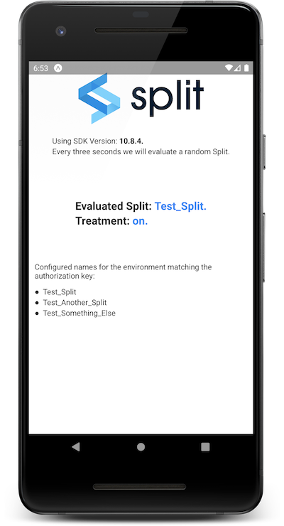

# Split React Native SDK example application with Expo.

This project was bootstrapped with [Expo-CLI](https://docs.expo.dev/workflow/expo-cli/) using its [Managed Workflow](https://docs.expo.dev/introduction/managed-vs-bare/).

```sh
$ npm install -g expo-cli
$ expo init ExpoExample
$ cd ExpoExample/
$ npm install --save @splitsoftware/splitio-react-native # or 'yarn add @splitsoftware/splitio-react-native' if using yarn dependency manager
```

## Table of Contents
* [Setup](#prerrequisites)
* [Available Scripts](#available-scripts)
  * [npm start](#npm-start)
  * [npm test](#npm-test)
  * [npm run ios](#npm-run-ios)
  * [npm run android](#npm-run-android)
  * [npm run eject](#npm-run-eject)

## Setup

You'll need [NodeJS](https://nodejs.org/en/download/). We recommend that you use the latest LTS version.

Second thing you'll need is to install [Expo-CLI](https://expo.io/) with the command `npm install -g expo-cli`.

To run the app, first change the `'<API-KEY>'` string in the App.js file with the browser key of your Split environment. Optionally, you can try a localhost configuration as the example below:

```javascript
const factory = SplitFactory({
    core: {
        authorizationKey: 'localhost',
        key: 'some_key'
    },
    features: {
        'Test_Split': 'on',
        'Test_Another_Split': 'dark',
        'Test_Something_Else': 'off'
    }
});
```

Then call `npm install` and `npm start`.

When running you should see a screen like the image below (taken from an Android device).



If any error rises when trying to run the app in the Android or iOS emulator, consider updating Expo-Cli, or uninstalling the Expo app in your emulator to let Expo-Cli install an updated one.

More information on the available scripts below.

## Available Scripts

### `npm start`

Runs your app in development mode.

Open it in the [Expo app](https://expo.io) on your phone to view it. It will reload if you save edits to your files, and you will see build errors and logs in the terminal.

### `npm test`

Runs the [jest](https://github.com/facebook/jest) test runner on your tests.

If you're looking for how to test with Split SDK, you can mock the module import (see [Jest documentation](https://jestjs.io/docs/jest-object#jestmockmodulename-factory-options)) using the [localhost mode](https://help.split.io/hc/en-us/articles/4406066357901-React-Native-SDK#localhost-mode) of the SDK, which is what we're doing [here](./__tests__/App.test.js).

### `npm run ios`

Like `npm start`, but also attempts to open your app in the iOS Simulator if you're on a Mac and have it installed.

### `npm run android`

Like `npm start`, but also attempts to open your app on a connected Android device or emulator.

### `npm run eject`

This will start the process of "[ejecting](https://docs.expo.dev/expokit/eject/)" your Expo managed project, in order to be handled as part of a larger standard native project (a.k.a bare project) -- one that you would normally create using Xcode, Android Studio, or `react-native init`.
