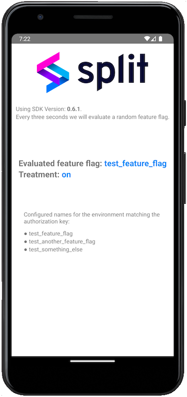

# React Native & Split SDK example application.

This project was bootstrapped with [Expo-CLI](https://docs.expo.io/versions/latest/workflow/expo-cli/) using its Managed Workflow.

```sh
$ npm install -g expo-cli
$ expo init react-native-sdk-example
$ cd react-native-sdk-example/
$ npm install --save @splitsoftware/splitio # or 'yarn add @splitsoftware/splitio' if using yarn dependency manager
```

Additionally, Split SDK can be used with React-Native-CLI. You can take a look at the [React Native getting started](https://facebook.github.io/react-native/docs/getting-started.html) guide if you want to test on your own application.

```sh
$ npm install -g react-native-cli
$ react-native init ReactNativeSdkExample
$ cd ReactNativeSdkExample/
$ npm install --save @splitsoftware/splitio # or 'yarn add @splitsoftware/splitio' if using yarn dependency manager
```

When running you should see a screen like the image below (taken from an Android device).



## Table of Contents
* [Prerrequisites](#prerrequisites)
* [Available Scripts](#available-scripts)
  * [npm start](#npm-start)
  * [npm test](#npm-test)
  * [npm run ios](#npm-run-ios)
  * [npm run android](#npm-run-android)
  * [npm run eject](#npm-run-eject)
* [About Split](#about-split)

## Prerrequisites

You'll need [NodeJS](https://nodejs.org/en/download/). We recommend that you use the latest LTS version.

Second thing you'll need is to install [Expo-CLI](https://expo.io/) with the command `npm install -g expo-cli`. 

To run the app, first change the '<API-KEY>' string in the App.js file with the browser key of your Split environment. Optionally, you can try a localhost configuration as the example below: 

```javascript
const factory = SplitFactory({
    core: {
        authorizationKey: 'localhost',
        key: 'react_native_example'
    },
    features: {
        'Test_Split': 'on',
        'Test_Another_Split': 'dark',
        'Test_Something_Else': 'off'
    }
});
```

Then call `npm install` and `npm start`. If any error rises when trying to run the app in the Android or iOS emulator, consider updating Expo-Cli or reinstalling the Expo app in your emulator.

More information on the available scripts below.

## Available Scripts

If Yarn was installed when the project was initialized, then dependencies will have been installed via Yarn, and you should probably use it to run these commands as well. Unlike dependency installation, command running syntax is identical for Yarn and NPM at the time of this writing.

### `npm start`

Runs your app in development mode.

Open it in the [Expo app](https://expo.io) on your phone to view it. It will reload if you save edits to your files, and you will see build errors and logs in the terminal.

#### `npm test`

Runs the [jest](https://github.com/facebook/jest) test runner on your tests.

Note: No test cases have been added since this is an example app.
If you're looking for how to test with Split SDK, you can:
   * mock the module import, see Jest documentation for that [here](https://facebook.github.io/jest/docs/en/jest-object.html#jestmockmodulename-factory-options)
   * use the localhost (offline) mode of the JavaScript Split SDK, more information [here](https://docs.split.io/docs/javascript-sdk-overview#localhost-mode)

#### `npm run ios`

Like `npm start`, but also attempts to open your app in the iOS Simulator if you're on a Mac and have it installed.

#### `npm run android`

Like `npm start`, but also attempts to open your app on a connected Android device or emulator. Requires an installation of Android build tools (see [React Native docs](https://facebook.github.io/react-native/docs/getting-started.html) for detailed setup). We also recommend installing Genymotion as your Android emulator. Once you've finished setting up the native build environment, there are two options for making the right copy of `adb` available to Create React Native App:

##### Using Android Studio's `adb`

1. Make sure that you can run adb from your terminal.
2. Open Genymotion and navigate to `Settings -> ADB`. Select “Use custom Android SDK tools” and update with your [Android SDK directory](https://stackoverflow.com/questions/25176594/android-sdk-location).

##### Using Genymotion's `adb`

1. Find Genymotion’s copy of adb. On macOS for example, this is normally `/Applications/Genymotion.app/Contents/MacOS/tools/`.
2. Add the Genymotion tools directory to your path (instructions for [Mac](http://osxdaily.com/2014/08/14/add-new-path-to-path-command-line/), [Linux](http://www.computerhope.com/issues/ch001647.htm), and [Windows](https://www.howtogeek.com/118594/how-to-edit-your-system-path-for-easy-command-line-access/)).
3. Make sure that you can run adb from your terminal.

#### `npm run eject`

This will start the process of "ejecting" from Create React Native App's build scripts. You'll be asked a couple of questions about how you'd like to build your project.

## About Split
 
Split is the leading Feature Delivery Platform for engineering teams that want to confidently release features as fast as they can develop them.
Split’s fine-grained management, real-time monitoring, and data-driven experimentation ensure that new features will improve customer experience without breaking or degrading performance.
Companies like Twilio, Salesforce, GoDaddy and WePay trust Split to power their feature delivery.
 
To learn more about Split, contact hello@split.io, or get started with feature flags for free at https://www.split.io/signup.
 
Split has built and maintains a SDKs for:
 
* Java [Github](https://github.com/splitio/java-client) [Docs](http://docs.split.io/docs/java-sdk-guide)
* Javascript [Github](https://github.com/splitio/javascript-client) [Docs](http://docs.split.io/docs/javascript-sdk-overview)
* Node [Github](https://github.com/splitio/javascript-client) [Docs](http://docs.split.io/docs/nodejs-sdk-overview)
* .NET [Github](https://github.com/splitio/.net-core-client) [Docs](http://docs.split.io/docs/net-sdk-overview)
* Ruby [Github](https://github.com/splitio/ruby-client) [Docs](http://docs.split.io/docs/ruby-sdk-overview)
* PHP [Github](https://github.com/splitio/php-client) [Docs](http://docs.split.io/docs/php-sdk-overview)
* Python [Github](https://github.com/splitio/python-client) [Docs](http://docs.split.io/docs/python-sdk-overview)
* GO [Github](https://github.com/splitio/go-client) [Docs](http://docs.split.io/docs/go-sdk-overview)
* Android [Github](https://github.com/splitio/android-client) [Docs](https://docs.split.io/docs/android-sdk-overview)
* IOS [Github](https://github.com/splitio/ios-client) [Docs](https://docs.split.io/docs/ios-sdk-overview)
 
For a comprehensive list of opensource projects visit our [Github page](https://github.com/splitio?utf8=%E2%9C%93&query=%20only%3Apublic%20).
 
**Learn more about Split:**
 
Visit [split.io/product](https://www.split.io/product) for an overview of Split, or visit our documentation at [docs.split.io](http://docs.split.io) for more detailed information.
